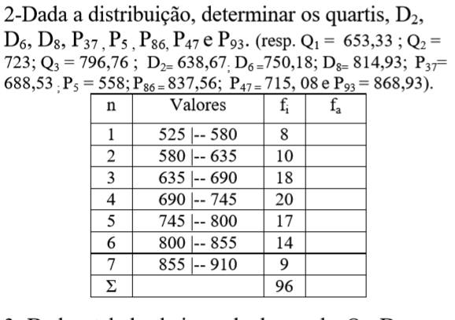
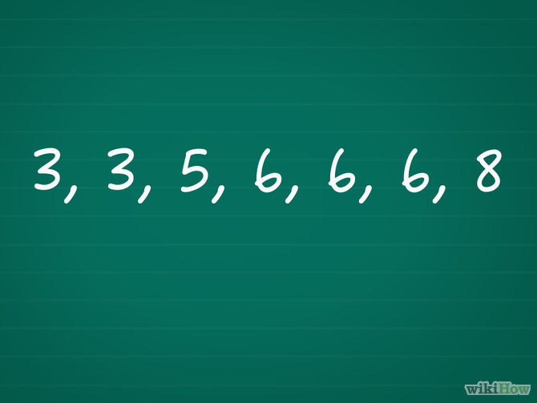

# Distribuicao dos dados


Um "conjunto de dados" consiste apenas no grupo de números que você está estudando no momento. Exemplo: o conjunto de dados lista a quantidade de livros lidos por cada estudante ao longo do último mês. 

Depois de classificar os valores, ele ficará da seguinte maneira: 3, 3, 5, 6, 6, 6, 8.

[EXPLICAR MAIS]

## Mediana

### Emprego da Mediana

- Quando desejamos obter o ponto que divide a distribuição em duas partes iguais.
- Quando há valores extremos que afetam de maneira acentuada a média aritmética.
- Quando a variável em estudo é salário.

## Separatriz

A Separatriz esta ligada à mediana relativamente à sua característica de separar a série em duas partes que apresentam o mesmo número de valores.

Essas medidas - os quartis, os decis e os percentis - são, juntamente com a mediana, conhecidas pelo nome genérico de separatrizes.

Para achar, com dados brutos, a posição do elemento que irá separar o conjunto utilizamos:

```
Qi = (i * n)/4
Di = (i * n)/10
Pi = (i * n)/100
```

Vamos visualizar melhor com esse exemplo:

```
{ 2, 5, 6, 9, 10, 13, 15 }

i = 2
n = 7
Q2 = (2 * 7)/4
Q2 = 3.5
```

Logo sabemos que a mediana se encontra após o terceiro elemento, nesse caso o `9` deixando o conjunto separado dessa forma:

```
{ 2, 5, 6 }
{ 10, 13, 15 }

Q1 = (1 * 7)/4 = 1.75 (2)
Elemento 5

Q3 = (3 * 7)/4 = 5.25 (6)
Elemento 13
```

Como percebemos que é a mesma fórmula onde só muda o valor da divisão, que define o tipo da medida da separatriz a ser usada, vamos criar uma fórmula mais genérica:

```
const medidaSeparatriz = (MEDIDA) => {
  switch (MEDIDA) {
    case 'Quartil':
      return 4;
    break;
    case 'Decil':
      return 10;
    break;
    case 'Percentil':
      return 100;
    break;
    default: return 0
  }
}

const calcularSeparatriz = (MEDIDA, x, n) => {
  const medida = medidaSeparatriz(MEDIDA);
  return (x * n)/medida;
}
```

O `n` será o valor da quantidade de elementos do conjunto, podemos criar uma função simples para isso:

```js
const conjunto = [ 2, 5, 6, 9, 10, 13, 15 ];

const calcularTamanhoConjunto = (conjunto) => {
  return conjunto.length;
};
```

Deixando nosso código assim:

```js
const conjunto = [ 2, 5, 6, 9, 10, 13, 15 ];

const medidaSeparatriz = (MEDIDA) => {
  switch (MEDIDA) {
    case 'Quartil':
      return 4;
    break;
    case 'Decil':
      return 10;
    break;
    case 'Percentil':
      return 100;
    break;
    default: return 0
  }
}

const calcularTamanhoConjunto = (conjunto) => {
  return conjunto.length;
};

const calcularSeparatriz = (MEDIDA, x, n) => {
  const medida = medidaSeparatriz(MEDIDA);
  return (x * n) / medida;
}

const Q2 = calcularSeparatriz('Quartil', 2, calcularTamanhoConjunto(conjunto));
console.log('Q2: ', Q2);
```

Bom já sabemos como achar a posição do elemento da separatriz, vamos agora fazer a função que irá devolver exatamente o elemento buscado:

```js
const retornarElemento = (conjunto, posicao) => {
  let pos = Math.ceil(posicao);
  // Precisamos subtrair em 1
  // pois a primeira posição é 0 e não 1
  let posicao_real = pos - 1;
  return conjunto[posicao_real];
};
```

Perceba que usei a função `Math.ceil(posicao)` pois ela irá arredondar o valor para cima, como vimos anteriormente que o `Q2` vale `3.5` sendo então o quarto elemento.

```js
const Q2 = calcularSeparatriz('Quartil', 2, calcularTamanhoConjunto(conjunto));
const Q2_elemento = retornarElemento(conjunto, Q2);
console.log('Q2: ', Q2); // 3.5
console.log('Elemento de Q2: ', Q2_elemento); // 9
```

**Bem simples não?**

Vamos fazer o seguinte exercício:

> Calcule os quartis da série: { 1, 1, 2, 3, 5, 5, 6, 7, 9, 9, 10, 13 }

O primeiro passo a ser dado é o da ordenação (crescente ou decrescente) dos valores:  { 2, 5, 6, 9, 10, 13, 15 }.

O valor que divide a série acima em duas partes iguais é igual a 9, logo a Mediana é igual a 9 o que nos leva a Q2 = 9, pois Q2 será sempre a mediana já que o Quartil é divido em 4:

```
Mediana = 9
Q2 = 9
```

Temos agora {2, 5, 6 } e {10, 13, 15 } como sendo os dois grupos de valores iguais proporcionados pela mediana ( quartil 2 ). Para o cálculo do quartil 1 e 3 basta calcular as medianas das partes iguais provenientes da verdadeira Mediana da série (quartil 2).

Logo em { 2, 5, 6 } a mediana é = 5, ou seja, o Quartil 1 = Q1 = 5

em {10, 13, 15 } a mediana é = 13, ou seja: será o quartil 3 = Q = 13

9/4 = 2.25
Q1 = 2.25
Q2 = 4.5
Q3 = 6.75
Q4 = 9

{ 2, 5, 6, 9, 10, 13, 15 } 


E para dados com intervalos:

```js
li+((i*(N/Medida_Separatriz)-Fant)/fmd)*h;
```

E sua variáveis são:

- li: Limite inferior da classe;
- i: ponto da separatriz para análise;
- N: somatorio das frequencias;
- valor: valor da medida da separatirz
- Fant: frequencia acumulada anterior;
- fmd: frequencia da classe analisada;
- h: 

Existem três tipos de medidas se separatriz:

- Percentil
- Decil
- Quartil

O valor dessa medida é que define o tamanho de cada parte a ser separada do nosso conjunto de dados.

- **Percentil**: irá dividir o conjunto de dados em 100 partes.
- **Decil**: irá dividir o conjunto de dados em 10 partes.
- **Quartil**: irá dividir o conjunto de dados em 4 partes.

Veja como é a fórmula do Percentil:


A partir da fórmula acima você consegue deduzir as fórmulas do Decil e Quartil?


Bom é **BEM LÓGICO** não?

Se o Percentil divide o conjunto em 100, o Decil em 10 e o Quartil em 4, basta trocar o `100` por `10` ou `4` respectivamente.

Para criarmos um algoritmo para solucionar esse problema devemos iniciar pelo cálculo mais interno `(N/valor)`, então antes de tudo devemos entender o que ele faz.

Vamos trabalhar com faixas de valores, como na tabela abaixo:



### Proporção - (N/valor)

Se podemos receber os valores 4, 10 e 100 para ele então notamos que ele separa nossos valores em partes, criando uma proporção. Por exemplo:

```
100/4 = 25 ou seja é uma proporção de 25 para 1
100/10 = 10 ou seja é uma proporção de 10 para 1
100/100 = 1 ou seja é uma proporção de 1 para 1
```

Com isso iremos agrupar a amostra em grupos menores.

Vamos utilizar esses dados de exemplo:

```
525|-580 8
580|-635 10
```

Onde `N` será o somatório das Frequencias, pois esse valor é a quantidade total de valores existentes na nossa amostra, nesse caso `N = 18`.

Então nossa Proporção do Percentil, por exemplo, é igual a `18/100 = 0.18`.

Podemos criar uma função para reaproveitar essa lógica assim:

```js
const proporcao = (N, valor) => {
  return N/valor;
};
```

### Primeiro valor da proporção - i*(N/valor)

Depois precisamos multiplicar nossa proporção pelo ponto da separatriz a ser analisado para achar o valor desse ponto baseado na proporção definida anteriormente.

Essa variável é passada junto com o tipo da proporção, por exemplo:

- Quartil2: i = 2
- Decil8: i = 8
- Percentil20: i = 20

Utilizando o **Percentil20** a fórmula ficará assim:

```
i*(N/valor) = 20*0.18
i*(N/valor) = 3.6
```

Escrevendo em JavaScript ficará assim:

```js
const proporcao = (N, valor) => {
  return N / valor;
};

const primeiroValor = (primeiro, proporcao) => {
  return primeiro * proporcao;
};
```

### Fant - Frequencia Acumulada Anterior - (i*(N/valor)-Fant)

Depois de calcularmos a proporção correta precisamos subitrair desse valor a Frequencia Acumulada Anterior.

A Frequencia Acumulada Anterior nada mais é que a soma da frequencia atual com a anterior, primeiro precisamos entender o que é a frequencia.



A Frequencia nos diz quantas vezes algum valor existe naquela faixa de valores, como podemos ver na imagem acima.

Logo para calcular Frequencia Acumulada Anterior basta somar o valor de sua Frequencia com a Frequencia da faixa anteior, como na primeira vez não temos uma Frequencia anterior ela sempre será seu próprio valor.


Depois devemos subtrair a Frequencia Acumulada Anterior do valor achado anteriormente.

**AINDA NAO SEI O PQ**

```
(i*(N/valor)-Fant)
```

Voltamos a utilizar esses dados de exemplo:

```
525|-580 8
580|-635 10
```

A `Fant` da primeira faixa de valores é:

```
525|-580 8
Frequencia anterior = 0
Frequencia atual = 8
Fant = 8
```

Agora colocando na fórmula do Percentil20:

```
(i*(N/valor)-Fant) = (3.6-8)
(i*(N/valor)-Fant) = -4.4
```

Fazendo a `Fant` da segunda faixa de valores:

```
525|-580 8
580|-635 10
Frequencia anterior = 8
Frequencia atual = 10
Fant = 18
```

Colocando na fórmula do Percentil20:

```
(i*(N/valor)-Fant) = (3.6-18)
(i*(N/valor)-Fant) = -14.4
```

Deixando a função em JavaScript assim:

```js
const proporcao = (N, valor) => {
  return N / valor;
};

const primeiroValor = (primeiro, proporcao) => {
  return primeiro * proporcao;
};

const subtrairFant = (primeiroValor, fant) => {
  return primeiroValor - fant;
}
```


### ((i*(N/valor)-Fant)/fmd)

### ((i*(N/valor)-Fant)/fmd)*h

### li+((i*(N/valor)-Fant)/fmd)*h

