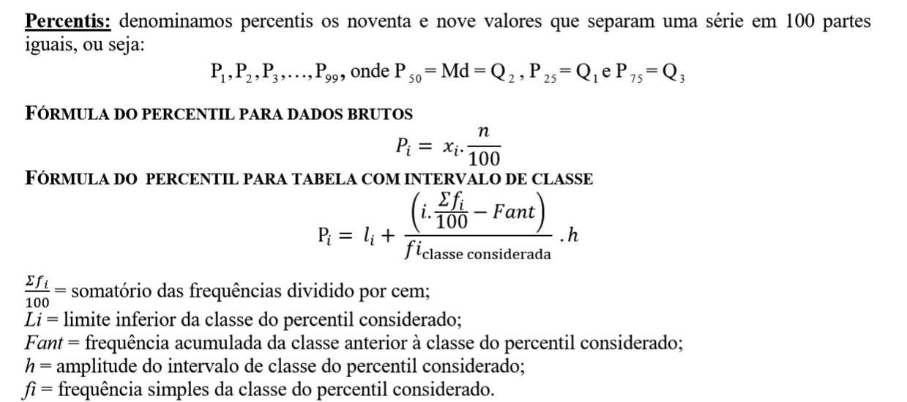
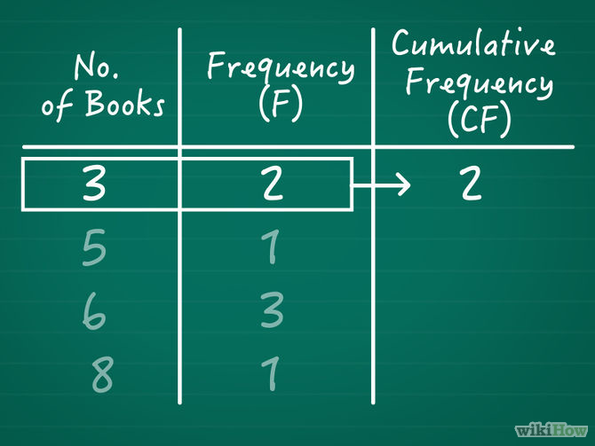

# Distribuicao dos dados


Um "conjunto de dados" consiste apenas no grupo de números que você está estudando no momento. Exemplo: o conjunto de dados lista a quantidade de livros lidos por cada estudante ao longo do último mês. Depois de classificar os valores, ele ficará da seguinte maneira: 3, 3, 5, 6, 6, 6, 8.

## Medidas de separatriz

Existem três tipos de medidas se separatriz:

- Percentil
- Decil
- Quartil

O valor dessa medida é que define o tamanho de cada parte a ser separada do nosso conjunto de dados.

- **Percentil**: irá dividir o conjunto de dados em 100 partes.
- **Decil**: irá dividir o conjunto de dados em 10 partes.
- **Quartil**: irá dividir o conjunto de dados em 4 partes.




Porém iremos trabalhar com faixas de valores, como na tabela abaixo:


Calcula a distribuicao dos dados analizados podendo ser Quartil, Decil e Percentil, sua fórmula é:

```js
li+((i*(N/valor)-Fant)/fmd)*h;
```

E sua variáveis são:

- li: Limite inferior da classe
- i: primeiro elemento
- N: somatorio das frequencias
- valor: valor de divisão podendo ser:
  - 4, 10, 100
- Fant: frequencia acumulada anterior
- fmd: frequencia da classe analisada

**Classe** é a faixa de valores que estamos trabalhando.

Para criarmos um algoritmo para solucionar esse problema devemos iniciar pelo cálculo mais interno `(N/valor)`, então antes de tudo devemos entender o que ele faz.

### Proporção - (N/valor)

Se podemos receber os valores 4, 10 e 100 para ele então notamos que ele separa nossos valores em partes, criando uma proporção. Por exemplo:

```
100/4 = 25 ou seja é uma proporção de 25 para 1
100/10 = 10 ou seja é uma proporção de 10 para 1
100/100 = 1 ou seja é uma proporção de 1 para 1
```

Com isso iremos agrupar a amostra em grupos menores.

### Porcentagem de dados equivalente - i*(N/valor)

Depois precisamos multiplicar nossa proporção pelo primeiro elemento para achar a porcentagem de dados equivalente da medida analisada.

Pois dessa forma iremos achar o menor valor da nossa amostra baseado na proporção definida anteriormente.

### Fant - Frequencia Acumulada Anterior - (i*(N/valor)-Fant)

A Frequencia Acumulada Anterior nada mais é que a soma da frequencia atual com a anterior, primeiro precisamos entender o que é a frequencia.


A Frequencia nos diz quantas vezes algum valor existe naquela faixa de valores, como podemos ver na imagem acima.

Logo para calcular Frequencia Acumulada Anterior basta somar o valor de sua Frequencia com a Frequencia da faixa anteior, como na primeira vez não temos uma Frequencia anterior ela sempre será seu próprio valor.




Depois devemos subtrair a Frequencia Acumulada Anterior do resultado de `i*(N/valor)`, para isso precisamos entender de onde vem esse valor.

### ((i*(N/valor)-Fant)/fmd)

### ((i*(N/valor)-Fant)/fmd)*h

### li+((i*(N/valor)-Fant)/fmd)*h

